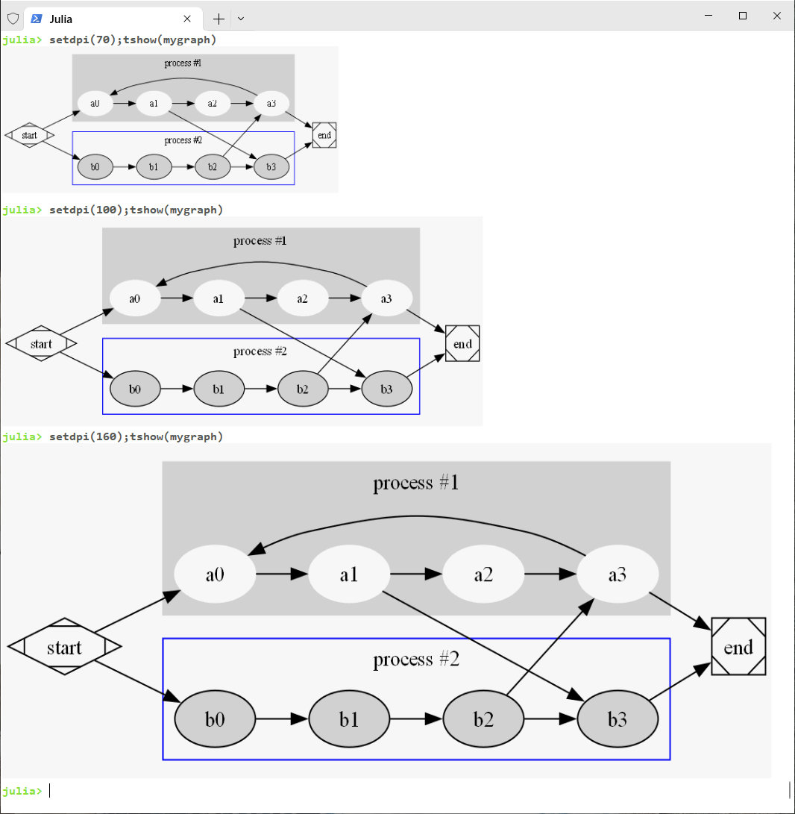
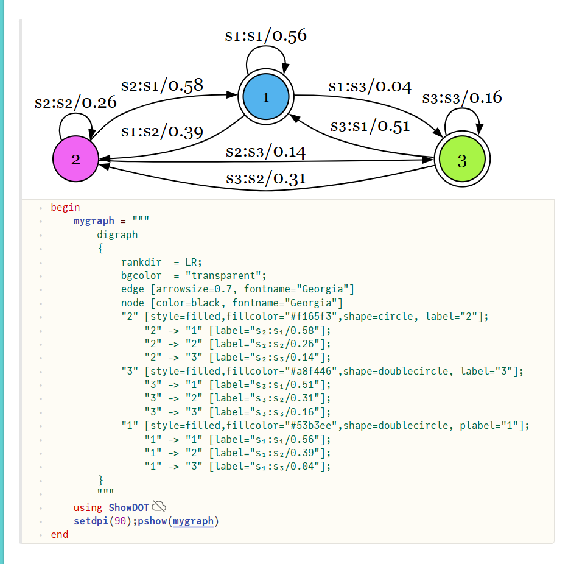
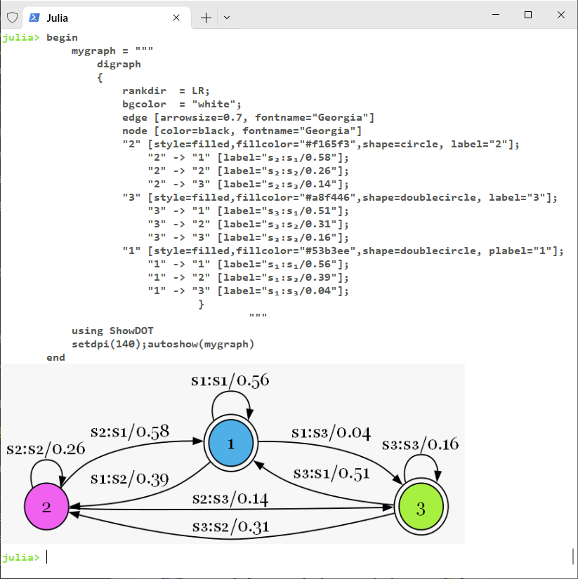
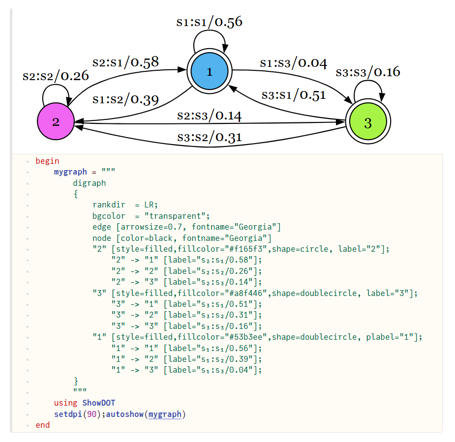

$$
\Huge{
    \bf
    \color{RoyalBlue}{Show}
    \color{Orange}{DOT}
    \color{purple}{{}^{👁}⎣{}^{👁}}
    }
$$


Show directed graph via DOT formatted string. Here the **Show**DOT means showing it inside a terminal 💻 or a webpage based notebook 📕 , or save it as a picture so as to show it inside other apps that can open it.


     [](https://hits.dwyl.com/sonosole/ShowDOT.jl)
  


# Installation 💾

```julia
using Pkg; Pkg.add("ShowDOT")
```

# Usage 👨‍🏫

## Show Inside Terminal 💻

It's a very simple API, pass the dot format string into `tshow`

```julia
tshow(dotstr::AbstractString)
```

here is an easy example

```julia
mygraph = """
digraph G {
  rankdir = LR;

  subgraph cluster_0 {
    style=filled;
    color=lightgrey;
    node [style=filled,color=white];
    a0 -> a1 -> a2 -> a3;
    label = "process #1";
  }

  subgraph cluster_1 {
    node [style=filled];
    b0 -> b1 -> b2 -> b3;
    label = "process #2";
    color=blue
  }

  start -> a0; a1 -> b3; a3 -> a0;
  start -> b0; b2 -> a3; a3 -> end; b3 -> end;
  start [shape=Mdiamond];
  end [shape=Msquare];
}
"""
setdpi(100)    # default dpi is 100, it affects both showing and saving
tshow(mygraph)
```

<div align="center">
  
</div>

## Show Inside Webpage Notebooks 🌐📕

With this simple API

```julia
pshow(dotstr::String)
```

we can show dot format string inside 🎈**Pluto** notebook

<div align="center">
  
</div>

## Automatically Show Wherever You Are 🎡

This simple API

```julia
autoshow(dotstr::String)
```

automatically shows DOT string when you are inside a terminal or Pluto or IJulia notebooks.

| `autoshow` in term                          | `autoshow` in Pluto                      |
| ------------------------------------------- | ---------------------------------------- |
|    |    |

## Save As Pictures 🗺️

### Unified Common Interface 📁

```julia
saveas(path_to_file::String, dotstr::String)
```

for example, save `mygraph::String` as a png file

```julia
my_pic_file = "/home/work/pic.png"
saveas(my_pic_file, mygraph)
```

supported picture types are svg/svgz, png, pdf, canon, cmap, cmapx, cmapx_np, dot, dot_json, eps, fig, gv, imap, imap_np, ismap, json, json0, mp, pdf, pic, plain/plain-ext, pov, ps, ps2, tk, vdx, vml/vmlz, xdot/xdot1.2/xdot1.4/xdot_json.

### Three Convenient APIs 📁

```julia
png(path_and_name_with_no_suffix::String, dotstr::String)
svg(path_and_name_with_no_suffix::String, dotstr::String)
pdf(path_and_name_with_no_suffix::String, dotstr::String)
```

for example, save `mygraph::String` as a svg file

```julia
my_pic_file = "/home/work/pic"
svg(my_pic_file, mygraph)
```

then `/home/work/pic.svg` is saved.

## Advanced Showcase for User Defined Struct
Just see a minimal example

```julia
struct MyStruct
    src::Int
    dst::Int
end

function mystruct2dotstr(x)
    s = x.src
    d = x.dst
    return "digraph G {$s -> $d}"
end

# show MyStruct object inside a terminal
Base.show(io::IO, ::MIME"text/plain", x::MyStruct)
    dotstr = mystruct2dotstr(x)
    return tshow(dotstr)
end

# show MyStruct object inside a webpage notebook, like Pluto/IJulia
Base.show(io::IO, ::MIME"image/svg+xml", x::MyStruct)
    dotstr = mystruct2dotstr(x)
    return pshow(dotstr)
end
```

now you can customize your own pretty shows. 💖

